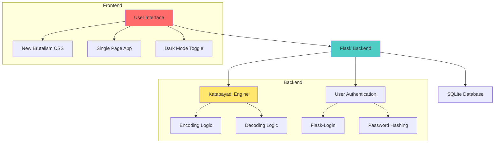

# 🎭 Katapayadi Cipher

**Ancient Indian Encoding System • Modern Web Implementation**

[](https://python.org)
[](https://flask.palletsprojects.com/)
[](LICENSE)
[](https://en.wikipedia.org/wiki/New_Brutalism)

<div align="center">
  
  <p><em>Katapayadi system used in Carnatic music Melakarta ragas classification</em></p>
</div>

## 🚀 Overview

Katapayadi Cipher is a modern web implementation of the ancient Indian Katapayadi encoding system. This project combines historical cryptography with contemporary web technology, featuring a New Brutalism design aesthetic and full user authentication.

### ✨ Key Features

- 🔐 **Ancient Encoding System**: Implement the authentic Katapayadi numerical notation
- 🎨 **New Brutalism Design**: Bold, raw, high-contrast interface
- 🔑 **Key-based Encryption**: Add security layers with 0-9 encryption keys
- 👤 **User Authentication**: Secure login/register system with admin panel
- 🌓 **Dark/Light Mode**: Toggle between themes with persistent preference
- 📱 **Responsive Design**: Works seamlessly on desktop and mobile
- 🖼️ **Visual Reference**: Integrated Katapayadi chart for easy reference

## 📋 Table of Contents

- [Overview](#-overview)
- [Architecture](#-architecture)
- [Installation](#-installation)
- [Usage](#-usage)
- [Katapayadi System](#-katapayadi-system)
- [API Endpoints](#-api-endpoints)
- [Project Structure](#-project-structure)
- [Screenshots](#-screenshots)
- [Contributing](#-contributing)
- [License](#-license)
- [Acknowledgments](#-acknowledgments)

## 🏗️ Architecture



## 🛠️ Installation

### Prerequisites

- Python 3.8+
- pip (Python package manager)
- Git

### Step-by-Step Setup

1. **Clone the repository**
```bash
git clone https://github.com/yourusername/katapayadi-cipher.git
cd katapayadi-cipher
```

2. **Create virtual environment**
```bash
# Windows
python -m venv venv
venv\Scripts\activate

# Mac/Linux
python3 -m venv venv
source venv/bin/activate
```

3. **Install dependencies**
```bash
pip install -r requirements.txt
```

4. **Run the application**
```bash
python app.py
```

5. **Access the application**
```
Open browser and navigate to: http://localhost:5000
```

### Default Admin Credentials
- **Username**: `admin`
- **Password**: `admin123`

> ⚠️ **Security Note**: Change the default admin password in production!

## 🎮 Usage

### 🔐 Encoding Process
1. **Login** to your account
2. Navigate to **Encode** page
3. Enter **Sanskrit text** in the textarea
4. Set **encryption key** (0-9)
5. Click **Encode** to generate encrypted numbers
6. Save the encoded numbers and key for later decoding

### 🔓 Decoding Process
1. Navigate to **Decode** page
2. Enter the **encoded numbers**
3. Enter the **correct decryption key**
4. Click **Decode** to retrieve original Sanskrit text
5. With wrong key, output will be meaningless Sanskrit

### 💡 Example
```
Sanskrit: कटपयादि
Key: 0 → Encoded: 11614
Key: 3 → Encoded: 44947

Numbers: 11614
Key 0 → Decoded: कटपयादि
Key 5 → Decoded: ञठयवञथ (meaningless!)
```

## 📚 Katapayadi System

### Historical Background
The Katapayadi system is an ancient Indian numerical notation and encoding system that assigns numbers to Sanskrit letters. It was extensively used by mathematicians like Aryabhata and in Carnatic music for classifying Melakarta ragas.

### Encoding Table

| Number | Consonants | Sanskrit | Example |
|--------|------------|----------|---------|
| 1 | क, ट, प, य | ककारः | क = 1 |
| 2 | ख, ठ, फ, र | खकारः | र = 2 |
| 3 | ग, ड, ब, ल | गकारः | ल = 3 |
| 4 | घ, ढ, भ, व | घकारः | व = 4 |
| 5 | ङ, ण, म, श | ङकारः | श = 5 |
| 6 | च, त, ष | चकारः | ष = 6 |
| 7 | छ, थ, स | छकारः | स = 7 |
| 8 | ज, द, ह | जकारः | ह = 8 |
| 9 | झ, ध, ळ | झकारः | झ = 9 |
| 0 | ञ, न, क्ष, ज्ञ | ञकारः | ज्ञ = 0 |

### Key Features of the System
- Each Sanskrit consonant maps to a number (1-9, 0)
- Vowels (अ, आ, इ, etc.) act as separators
- Numbers traditionally read from right to left
- Used in mathematics, astronomy, and music
- Provides mnemonic advantages for memorization

## 🔌 API Endpoints

### Public Endpoints
- `GET /` - Home page
- `GET /login` - Login page
- `GET /about` - About page
- `GET /system` - Katapayadi system explanation
- `POST /login` - User authentication
- `POST /register` - User registration

### Protected Endpoints (Require Login)
- `GET /dashboard` - User dashboard
- `GET /encode` - Encoding interface
- `GET /decode` - Decoding interface
- `POST /api/encode` - API for encoding
- `POST /api/decode` - API for decoding
- `GET /admin` - Admin panel (admin only)
- `GET /logout` - User logout

### API Response Format
```json
{
  "encoded": "11614",
  "original": "कटपयादि",
  "key": 0
}
```

## 📁 Project Structure

```
katapayadi-cipher/
├── app.py                      # Main Flask application
├── requirements.txt            # Python dependencies
├── .env                        # Environment variables
├── static/
│   └── style.css              # New Brutalism CSS styles
├── templates/
│   └── index.html             # Single-page HTML template
├── katapayadi.db              # SQLite database (auto-generated)
├── README.md                  # This file
└── LICENSE                    # MIT License
```

### File Descriptions

| File | Purpose |
|------|---------|
| `app.py` | Flask backend with Katapayadi logic, user auth, and routing |
| `style.css` | New Brutalism design with dark mode support |
| `index.html` | Single-page application with all UI components |
| `requirements.txt` | Python package dependencies |
| `.env` | Environment configuration |

## 📸 Screenshots

<div align="center">
  <table>
    <tr>
      <td align="center">
        <br>
        <em>Login Interface</em>
      </td>
      <td align="center">
        <br>
        <em>Encoding Interface</em>
      </td>
    </tr>
    <tr>
      <td align="center">
        <br>
        <em>Dark Mode Theme</em>
      </td>
      <td align="center">
        <br>
        <em>Katapayadi System</em>
      </td>
    </tr>
  </table>
</div>

## 🛡️ Security Features

- **Password Hashing**: Uses Werkzeug secure password hashing
- **Session Management**: Flask-Login for secure session handling
- **SQL Injection Protection**: SQLAlchemy ORM prevents injection
- **Key-based Encryption**: Additional security layer with 0-9 keys
- **Admin Separation**: Separate admin panel with restricted access
- **Environment Variables**: Sensitive data stored in `.env`

## 🧪 Testing

Run the application and test with these sample inputs:

### Test Cases
```python
# Encoding Tests
Input: "कटपयादि", Key: 0 → Output: "11614"
Input: "राम", Key: 0 → Output: "25"
Input: "कृष्ण", Key: 3 → Output: "469"

# Decoding Tests
Input: "11614", Key: 0 → Output: "कटपयादि"
Input: "11614", Key: 5 → Output: "ञठयवञथ" (wrong key)
```

## 🚀 Deployment

### Deploy to Heroku
```bash
# Create Heroku app
heroku create katapayadi-cipher

# Set environment variables
heroku config:set SECRET_KEY=your-secret-key-here
heroku config:set FLASK_ENV=production

# Deploy
git push heroku main

# Open application
heroku open
```

### Deploy to PythonAnywhere
1. Upload files to PythonAnywhere
2. Create virtual environment
3. Install requirements
4. Configure WSGI file
5. Reload web app

## 🤝 Contributing

We welcome contributions! Here's how you can help:

1. **Fork** the repository
2. **Create a feature branch**
```bash
git checkout -b feature/amazing-feature
```
3. **Commit your changes**
```bash
git commit -m 'Add amazing feature'
```
4. **Push to the branch**
```bash
git push origin feature/amazing-feature
```
5. **Open a Pull Request**

### Areas for Contribution
- Add more Katapayadi variations
- Improve UI/UX design
- Add unit tests
- Create API documentation
- Add multilingual support
- Implement advanced encryption features

## 📄 License

This project is licensed under the MIT License - see the [LICENSE](LICENSE) file for details.

```
MIT License

Copyright (c) 2024 Katapayadi Cipher Project

Permission is hereby granted, free of charge, to any person obtaining a copy
of this software and associated documentation files (the "Software"), to deal
in the Software without restriction, including without limitation the rights
to use, copy, modify, merge, publish, distribute, sublicense, and/or sell
copies of the Software, and to permit persons to whom the Software is
furnished to do so, subject to the following conditions:

The above copyright notice and this permission notice shall be included in all
copies or substantial portions of the Software.
```

## 🙏 Acknowledgments

- **Ancient Indian Mathematicians** for creating the Katapayadi system
- **Carnatic Music Tradition** for preserving the system in raga classification
- **Flask Community** for the excellent web framework
- **New Brutalism Design** movement for inspiration
- **All Contributors** who help improve this project

## 📚 References

1. Datta, B., & Singh, A. N. (1962). *History of Hindu Mathematics*
2. Rajagopal, C. T. (1944). *The Katapayadi System of Numerical Notation*
3. *Melakarta Ragas* - Carnatic music classification system
4. Flask Documentation: https://flask.palletsprojects.com/
5. New Brutalism in Web Design: https://brutalistwebsites.com/

## 🎯 Future Enhancements

- [ ] Mobile application version
- [ ] Advanced encryption algorithms
- [ ] Multi-language support
- [ ] Audio pronunciation guide
- [ ] Historical context timeline
- [ ] Interactive tutorials
- [ ] Export/import functionality
- [ ] Social sharing features

## 📞 Support

For support, feature requests, or bug reports:
1. Open an [Issue](https://github.com/yourusername/katapayadi-cipher/issues)
2. Email: your-email@example.com
3. Join our [Discord Community](https://discord.gg/your-invite-link)

---

<div align="center">
  <p>Made with ❤️ and 🪨 by the Katapayadi Cipher Team</p>
  <p>Where Ancient Wisdom Meets Modern Technology</p>
  
  
  
  <p>
    <a href="https://github.com/yourusername/katapayadi-cipher/stargazers">
      
    </a>
    <a href="https://github.com/yourusername/katapayadi-cipher/forks">
      
    </a>
    <a href="https://github.com/yourusername/katapayadi-cipher/issues">
      
    </a>
  </p>
</div>

---

**🌟 Star this repo if you find it interesting!**  
**🔗 Share with others interested in cryptography or ancient Indian systems!**
